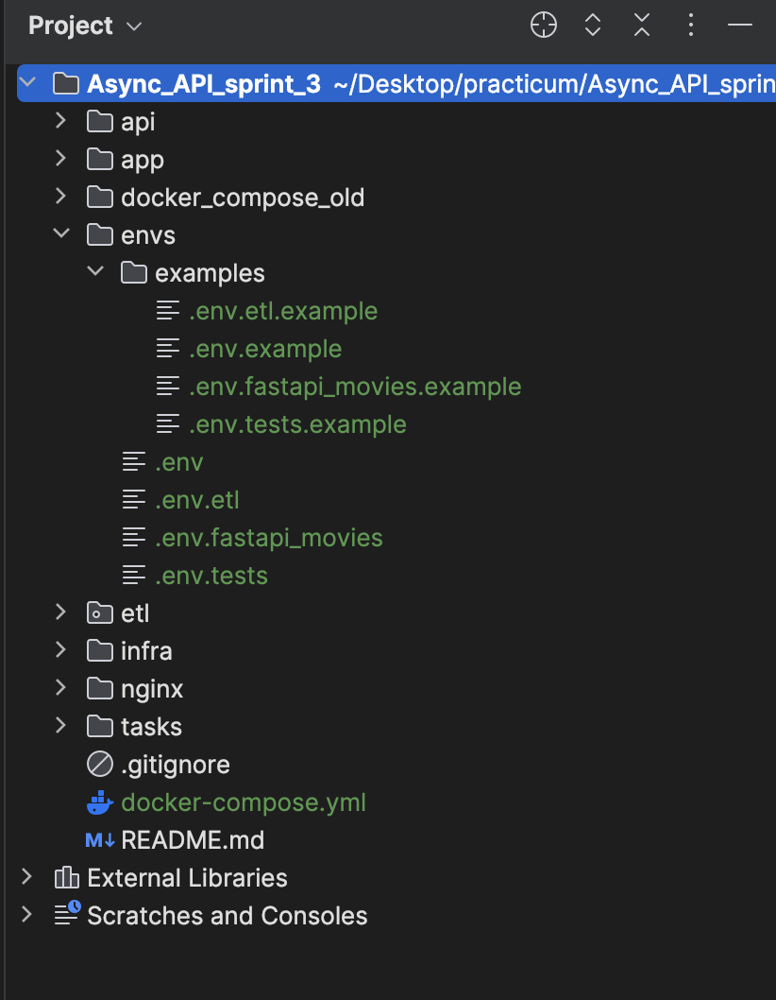

# Docker compose

## Profiles
Чтобы не поднимать всю вселенную разом, можно использовать профили, например:
```
docker compose --profile admin up
```
Доступные профили:
- admin - только то, что необходимо для работы Django
- admin-dev - только база с высунутым наружу портом
- etl - только etl часть
- fastapi - только окружение для fastapi
- all - admin, etl, fastapi, но без тестов


## External volumes
В docker-compose используются внешние статические зависимости, чтобы сделать управление данными более надежным. Чтобы инициализировать такую зависимость в docker, нужно выполнить команду:
```
docker volume create <volume name> --opt type=none --opt device=<path to volume> --opt o=bind
```

 вот так можно удобно создавать админа make admin в терминале

 чтобы перезапустить etl сервис и чтобы он снова прогнал все данные из постгри в эластик, нужно внутри контейнера удалить etl_state.json (на случай если тестами все почистишь)

 Тесты в моменте фэйлятся, но подключаются и к redis + elastic, и чистят эластик полностью (что плохо) пофикшу позже

обрати внимание что fastapi сейчас на порту 8001 джанго админка на 8000

 сделал общую папку под .env

```docker-compose --env-file ./envs/.env up --build``` запуск если env слетают
