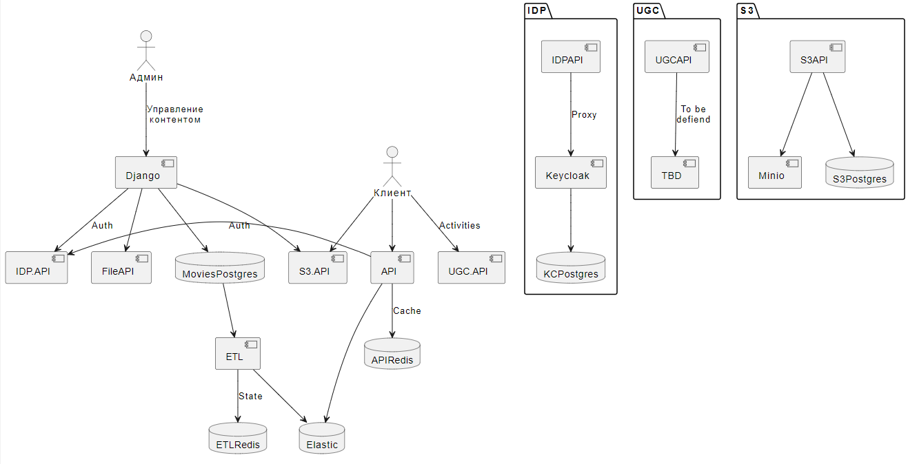

## Проектная работа 11 и 12 спринтов
В этом спринте мы создали сервис нотификаций, который позволяет:

- управлять шаблонами рассылок;
- создавать нотификации на базе шаблонов или в свободной форме;
- отправлять нотификации (включая отложенную отправку и отправку по расписанию);
- использовать различные каналы отправки (на почту по SMTP или SendGrid, или через websocket);
- взаимодействие с сервисов idp через grpc;
- просматривать отправленные нотификации.

Взаимодействие построено на RabbitMQ, в качестве базы используется MongoDB.

### Допущения
В качестве упрощения все было реализовано в рамках одного сервиса,
т.к. механика взаимодействия никак не изменится при переходе на выделенные воркеры,
а процесс разработки существенно проще. В данном подходе инстансы сервиса не сильно
отличаются от воркеров. При деплойменте имеет смысл вместо воркеров использовать
лямбда-инстансы с автоматическим скейлингом в зависимости от нагрузки.

Работа с сокетами на самом деле должна выглядить иначе, т.к. пользователь подключается
к определенному инстансу и нотификация необходимо отправлять с него.

## Проектная работа 10 спринта
В этом спринте наша команда:

- Подключила отправку ошибок в `Sentry`
- Добавила `CRUD` для `закладок`, `лайков` и `рецензий`
- Подключила  `elastic`, `logstash`, `kibana` (ELK stack) к UGC:
- Настроила `CI/CD` с помощью `github actions`
- Провела исследование базы данных `mognoDB`

### Доска на которой мы вели задачи:
[Канбан доска](https://github.com/users/oruchkin/projects/12/views/1)

### - Подключение отправки ошибок в Sentry
Отправка в Sentry реализована в сервисе API,
т.к. только в нем на данный момент ведется активная разработка
и чтобы не копировать одно и то же много раз.

### - Добавиление CRUD для закладок, лайков и рецензий
В качестве варианта разработки был выбран подход добавления функционала в существующий сервис `api`. Этот подход был выбран,
т.к. социальная составляющая в описании фильма достаточно важна и не хотелось бы нагружать клиента дополнительным походом в API
за этими данными (плюс у нас тут же есть кэш для этого).

Для простоты демонстрации `user_id` передается явным образом. В `GET api/films` сделана примерная реализация
получения пользовательских данных из авторизационного заголовка (включая валидацию токена и introspect при необходимости).

Лайки реализованы, как было рекомендовано в задаче, через рейтинг от 0 до 10.
Для рецензий добавлена сортировка по количеству пололжительных пользовательских реакций. Для рецензий реакции представляют
из себя булевый флаг - согласен, не согласен.

Лайки и закладки добавлены в API поиска по фильмам, т.е. для найденных фильмов
отображается пользовательский рейтинг, количество голосов и добвлен ли этот фильм в закладки
для текущего пользователя (если он авторизован).

### - Подключение ELK stack к UGC:

запустить сервисы `UGC` + `ELK` стэк можно этой командой из папки [UGC](https://github.com/oruchkin/Async_API_sprint_3/tree/main/ugc#readme):
```
docker-compose --profile ugc --profile elk up --build -d
```

в файле `api/src/api/ugc_logs.json` уже есть шаблонные логи которые заполнятся автоматически

Чтобы завести паттерн, нужно загнать данные в logastash:
1) запустить все сервисы и отправить сюда `http://127.0.0.1:5000/event`
```json
{
    "type": "movie_progress",
    "user_id": "4518e644-1ff3-4003-a14e-99dfe3fdd7ab",
    "movie_id": "e9897504-9b73-40bb-a22e-815daf7a190d",
    "progress": 1232
}
```
перейдите в Management → Stack Management → Index Patterns и нажмите Create index patter имя `app-2024.08`.


----------

## Проектная работа 9 спринта
Мы cделали User Generated Content Service

`README.md` спринта 9 находится здесь:

[ссылка на README.md 9 спринта](https://github.com/oruchkin/Async_API_sprint_3/tree/da3178d66e5d740c1d5889ee8cefe040df665d48/ugc#readme)

---

## Проектная работа 8 спринта

В этом спринте наша команда:

- Создала интеграцию `Auth-сервиса` `idp` с административной панелью (вход из админки `django`)
- Добавила трассировку через `Jaeger`
- Добавила в сервис `idp` механизм ограничения количества запросов к серверу `rate-limit`
- Добавила внешние авторизации через `VK` и `Google`
- Партицировала таблицу `users`

### Доска на которой мы вели задачи:
[Канбан доска](https://github.com/users/oruchkin/projects/9/views/1)


### Как запустить проект:
из папки `infra` запускаем:
```
docker-compose --profile idp --profile admin up
```
запустятся `postgres`, `redis`, `idp`, `keycloak`, `jaeger`, `django-admin`


## Детальнее про задачи 

### - подключение внешних провайдеров:

### Keycloak external IDP
Мыможем использовать только Direct Naked Impersonation,
т.к. external to internal token exchange требуют валидации токена, который VK ID не предоставляет
Чтобы настроить Keycloak внимательно следуем инструкции:
https://www.keycloak.org/docs/latest/securing_apps/#direct-naked-impersonation

#### VK ID
Просто делаем все, как тут сказано
https://id.vk.com/about/business/go/docs/ru/vkid/latest/vk-id/connection/create-application

#### Google
Настройка Google с использованием этого руководства: 

https://keycloakthemes.com/blog/how-to-setup-sign-in-with-google-using-keycloak

- Включите поток аутентификации - Standard flow: 
 - используйте `http://localhost:8000/*`   - в качестве  `Valid redirect URIs`.
 - Для `Google IDP` выберите `Post login flow` как `None`.

### - партицирование:

для того чтобы создать партиции в таблице необходимо:
- инициализировать кейклок,
- после его инициализации мы запускаем скрипт `./run_partitioning.sh` (скрипт находится в папке `idp/db_partitioning`)

в скритпе есть две переменных `POSTGRES_HOST` и `POSTGRES_DB` которые отличаются от базового .env
там прописаны примеры которые перезаписывают значение для локального применения (их можно менять)

скрипт создаст партиции в таблице `user_entity`


----
# ВНИМАНИЕ!
### Ниже данные с предыдущих спринтов 
### то что ниже не относится к спринту 8

---
## Спринт 7
ридми спринта 7 находится здесь:

[ссылка на README.md 7 спринта](https://github.com/oruchkin/Async_API_sprint_3/tree/main/idp#readme)

---
## Проектная работа 6 спринта

В этом спринте наша команда: 
- Развернула S3 хранилище ```minio```, 
- Написала сервис ```File_Service``` для взаимодействия с ```S3``` харнилищем,
- Внесла изменения в ```Django``` проект, чтобы он мог работать с ```S3```
- Внесла изменения в ```ETL``` проект, чтобы он мог обновлять данные с ```S3```
- Доработала сервис ```Api Movies```
- Написала тесты

### Доска на которой мы вели:
[Канбан доска](https://github.com/users/oruchkin/projects/7/views/1)

# Docker compose
## Profiles
Чтобы не поднимать всю вселенную разом, можно использовать профили, например:
```
docker compose --profile admin up
```
Доступные профили:
- admin - только то, что необходимо для работы Django
- admin-dev - база и хранилища файлов с высунутыми наружу портами
- etl - только etl часть
- fastapi - только окружение для fastapi
- all - admin, etl, fastapi, но без тестов


## External volumes
В docker-compose используются внешние статические зависимости, чтобы сделать управление данными более надежным. Чтобы инициализировать такую зависимость в docker, нужно выполнить команду:
```
docker volume create <volume name> --opt type=none --opt device=<path to volume> --opt o=bind
```

 вот так можно удобно создавать админа make admin в терминале

 чтобы перезапустить etl сервис и чтобы он снова прогнал все данные из постгри в эластик, нужно внутри контейнера удалить etl_state.json (на случай если тестами все почистишь)

 Тесты в моменте фэйлятся, но подключаются и к redis + elastic, и чистят эластик полностью (что плохо) пофикшу позже


```docker-compose --env-file .env up --build``` запуск если env слетают

# IDP
Check later: https://www.reddit.com/r/Python/comments/16pin4l/a_maintained_library_for_oidc_in_python/

JWT libraries: https://jwt.io/libraries?language=Python

## Keycloak

### Development
Setup all the environment variables and run
```
docker compose --profile idp-dev up --attach keycloak
```

### Setup client
From https://medium.com/@imsanthiyag/introduction-to-keycloak-admin-api-44beb9011f7d
Go to Clients, on the Clients list tab select admin-cli and in Capability config set `Client authentication` to On. Also check `Service accounts roles`.
After hitting Save you must see new Credentials tab on the top. Switch to that tab and copy Client secret value.
Important step. To perform specific operations like create users client must have roles assigned. Click on the `admin-cli` client, then open `Service accounts roles` tab
and assign `manage-users` role from the `master-realm`.


Also we need `manage-clients` role to add roles for current client.
And `view-clients` to get id of the current client.

### Tips
Open Dev tab in browser to see what requests Keycloak UI is sending to the API


# PlantUML
Run with
```
docker run -d -p 8080:8080 plantuml/plantuml-server:jetty
```
update vscode settings (https://marketplace.visualstudio.com/items?itemName=jebbs.plantuml#use-plantuml-server-as-render)
```
"plantuml.server": "http://host.docker.internal:8080",
"plantuml.render": "PlantUMLServer",
"plantuml.exportOutDir": "docs/diagrams/out",
```
Alt+D to preview

Online editor https://www.plantuml.com/plantuml or https://www.planttext.com/


