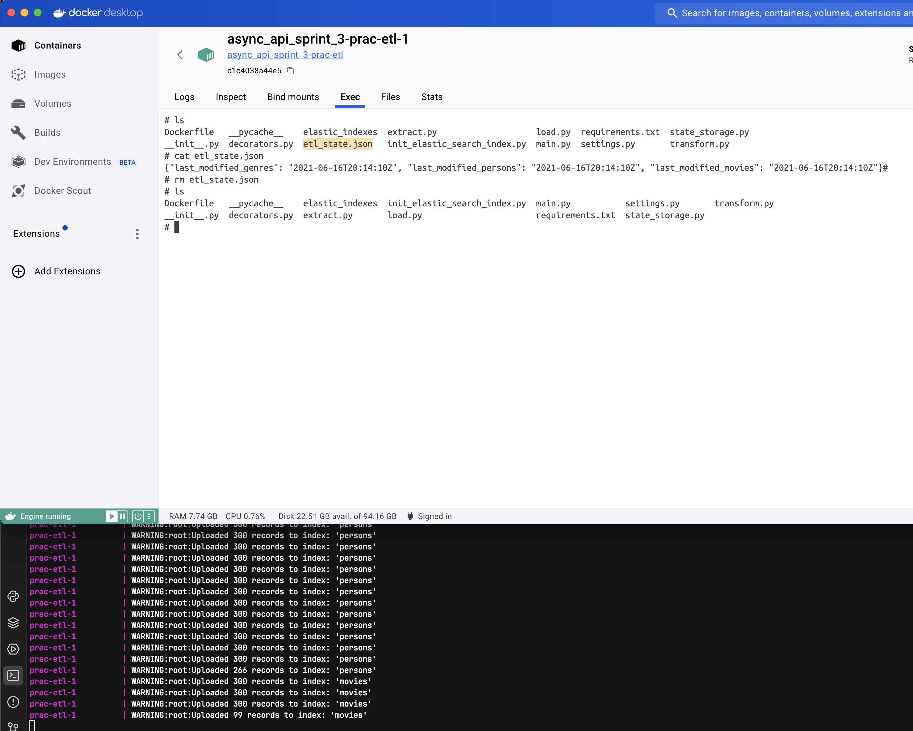

## Проектная работа 6 спринта

В этом спринте наша команда: 
- Развернула S3 хранилище ```minio```, 
- Написала сервис ```File_Service``` для взаимодействия с ```S3``` харнилищем,
- Внесла изменения в ```Django``` проект, чтобы он мог работать с ```S3```
- Внесла изменения в ```ETL``` проект, чтобы он мог обновлять данные с ```S3```
- Доработала сервис ```Api Movies```
- Написала тесты

### Доска на которой мы вели:
[Канбан доска](https://github.com/users/oruchkin/projects/7/views/1)

# Docker compose
## Profiles
Чтобы не поднимать всю вселенную разом, можно использовать профили, например:
```
docker compose --profile admin up
```
Доступные профили:
- admin - только то, что необходимо для работы Django
- admin-dev - база и хранилища файлов с высунутыми наружу портами
- etl - только etl часть
- fastapi - только окружение для fastapi
- all - admin, etl, fastapi, но без тестов


## External volumes
В docker-compose используются внешние статические зависимости, чтобы сделать управление данными более надежным. Чтобы инициализировать такую зависимость в docker, нужно выполнить команду:
```
docker volume create <volume name> --opt type=none --opt device=<path to volume> --opt o=bind
```

 вот так можно удобно создавать админа make admin в терминале

 чтобы перезапустить etl сервис и чтобы он снова прогнал все данные из постгри в эластик, нужно внутри контейнера удалить etl_state.json (на случай если тестами все почистишь)

 Тесты в моменте фэйлятся, но подключаются и к redis + elastic, и чистят эластик полностью (что плохо) пофикшу позже


```docker-compose --env-file .env up --build``` запуск если env слетают
