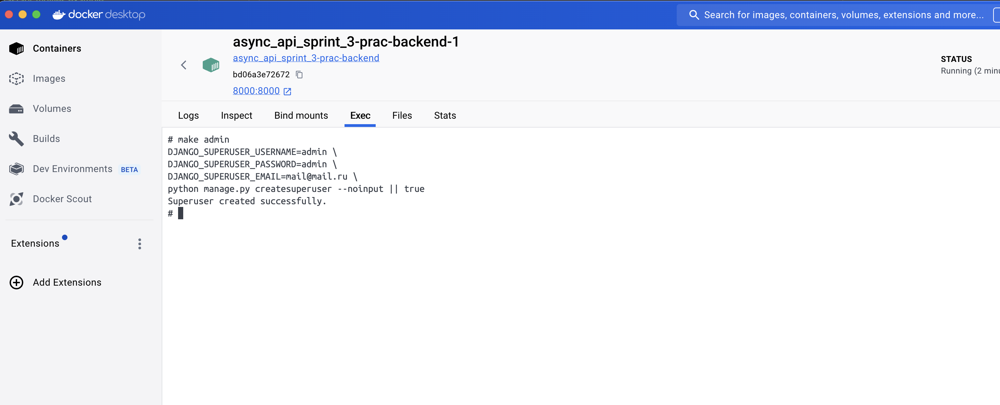

 вот так можно удобно создавать админа make admin в терминале

 чтобы перезапустить etl сервис и чтобы он снова прогнал все данные из постгри в эластик, нужно внутри контейнера удалить etl_state.json (на случай если тестами все почистишь)

 Тесты в моменте фэйлятся, но подключаются и к redis + elastic, и чистят эластик полностью (что плохо) пофикшу позже

обрати внимание что fastapi сейчас на порту 8001 джанго админка на 8000

 сделал общую папку под .env

```docker-compose --env-file ./envs/.env up --build``` запуск если env слетают


# Проектная работа спринта

В папке **tasks** ваша команда найдёт задачи, которые необходимо выполнить в третьем спринте модуля "Сервис Async API".

Как и в прошлом спринте, мы оценили задачи в стори поинтах.

Вы можете разбить эти задачи на более маленькие, например, распределять между участниками команды не большие куски задания, а маленькие подзадачи. В таком случае не забудьте зафиксировать изменения в issues в репозитории.

**От каждого разработчика ожидается выполнение минимум 40% от общего числа стори поинтов в спринте.**
