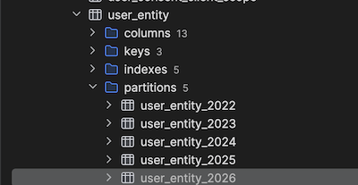

для того чтобы создать партиции в таблице необходимо:
- инициализировать кейклок стандартным запуском docker-compose up (описаным в корне),
- после его инициализации мы запускаем скрипт `./run_partitioning.sh`

в скритпе есть две переменных `POSTGRES_HOST` и `POSTGRES_DB` которые отличаются от базового .env
там прописаны примеры которые перезаписывают значение для локального применения (их можно менять)

скрипт создаст партиции в таблице `user_entity`

