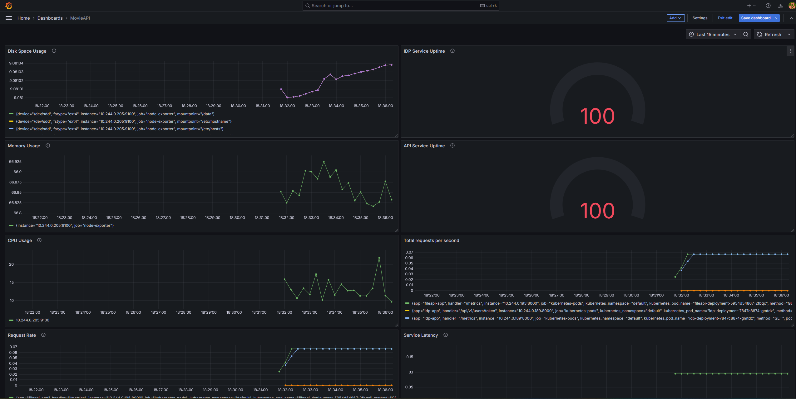
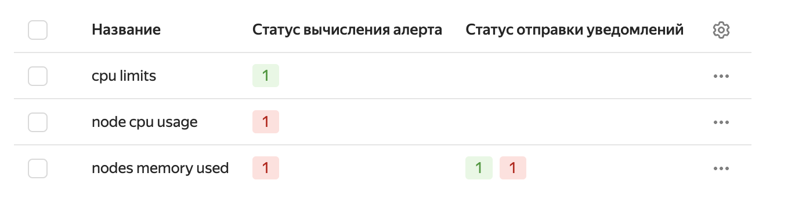
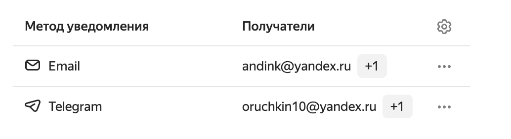
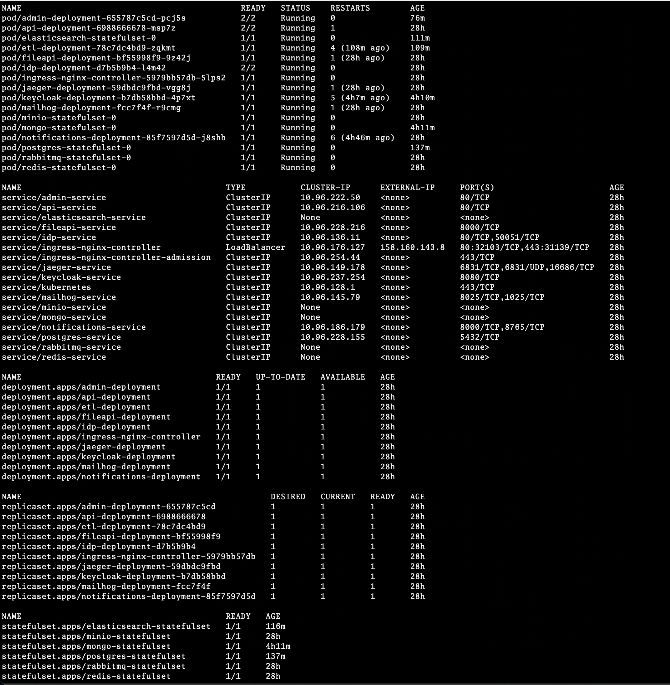

# Проектная работа 13 и 14 спринтов

В этом спринте наша команда:
- Описала манифесты для всех сервисов кинотеатра
- Задеплоила все сервисы кинотеатра в Managed Service Kubernetis yandex.cloud
- Организала сбор метрик в prometeus
- Визуализировала метрики в графана
- Настроила алертинг на email / telegram


## Доска на которой мы вели задачи:
[Канбан доска](https://github.com/users/oruchkin/projects/15)

---

# Hosts
127.0.0.1 	keycloak.local
127.0.0.1 	jaeger.local
127.0.0.1   mailhog.local
127.0.0.1   admin.local
127.0.0.1   fileapi.local
127.0.0.1   api.local
127.0.0.1   idp.local

# Minikube

## Start
```bash
minikube start
```

## Remove everything
```bash
kubectl delete all --all
```
or more aggressive including docker images
```bash
minikube delete
```

## Enable ingress
```bash
minikube addons enable ingress 
```

## Tunnel for http access
Чотбы пробросить роутинг до хостов обязательно сначала запустить туннель
```bash
minikube tunnel
```

## Docker
Использовать внутрениий docker
```
minikube docker-env
```
и внимательно читаем, что там написано!

## [Mount path](https://minikube.sigs.k8s.io/docs/handbook/mount/)
```bash
minikube mount C:/path/to/local/data:/mnt/data
```

# Kubectl

Посмотреть, что сейчас запущено
```bash
kubectl get all
```

If any errors use
```bash
kubectl descript pod {podname}
```
to see all the details and errors

Expose port
```bash
kubectl port-forward pod/postgres-statefulset-0 5432:5432
```

## Restart pod
```bash
kubectl delete pod <pod_name>
```

## Find service url
1. Connect to any pod:
```bash
kubectl exec -it podName -n namespace -- /bin/sh
```
Install util:
```bash
apt-get update && apt-get install dnsutils
```
Resolve ip-address (check service in kubectl get all):
```bash
nslookup ip-address
```

# Helm
## Export results
```bash
helm template . > compiled.yaml
```

## Install chart
```bash
helm install movies .
```
and to update it
```bash
helm upgrade movies .
```

# Ya.cloud storage
[Volumes](https://yandex.cloud/ru/docs/managed-kubernetes/qa/volumes)
Dynamic provisioning = [динамическая подготовка тома](https://yandex.cloud/ru/docs/managed-kubernetes/operations/volumes/dynamic-create-pv)
Static provisioning = [статическая подготовка тома](https://yandex.cloud/ru/docs/managed-kubernetes/operations/volumes/static-create-pv)
[Тут](https://bluexp.netapp.com/blog/cvo-blg-static-vs.-dynamic-storage-provisioning-a-look-under-the-hood) можно почитать, чем они отличаются,
если кратко, то, если нет никаких требований, то проще и дешевле использовать dynamic provisioning. А базы в k8s лучше вообще не деплоить.

Узлы должны быть минимум 8Gb
Keycloak:23.0.5 т.к. >=24 требует https

# Grafana metrics:
1. Service Uptime
   Chart Type: Single Stat or Gauge
   Query: avg_over_time(up{job="your_service"}[1h]) * 100
   Description: Displays the percentage uptime of a service over the past hour.


2. Request Rate
   Chart Type: Time Series
   Query: rate(http_requests_total{job="your_service"}[1m])
   Description: Tracks the rate of HTTP requests per second for a service.


3. Error Rate
   Chart Type: Bar Gauge or Time Series
   Query: rate(http_requests_total{job="your_service", status=~"5.."}[1m])
   Description: Displays the rate of HTTP 5xx errors over time.


4. CPU Usage
   Chart Type: Time Series
   Query: 100 - (avg by (instance) (irate(node_cpu_seconds_total{mode="idle"}[5m])) * 100)
   Description: Monitors CPU utilization for service instances.


5. Memory Usage
   Chart Type: Time Series
   Query: (node_memory_MemTotal_bytes - node_memory_MemAvailable_bytes) / node_memory_MemTotal_bytes * 100
   Description: Tracks memory usage as a percentage.


6. Service Latency
   Chart Type: Time Series or Heatmap
   Query: histogram_quantile(0.95, sum(rate(http_request_duration_seconds_bucket{job="your_service"}[5m])) by (le))
   Description: Shows the 95th percentile latency of HTTP requests.


7. Active Connections
   Chart Type: Time Series
   Query: sum(nginx_http_connections{job="your_service"})
   Description: Tracks the number of active connections for a service.


8. Service Restarts
   Chart Type: Table or Time Series
   Query: rate(process_start_time_seconds{job="your_service"}[1m])
   Description: Monitors unexpected service restarts.


9. Disk Space Usage
   Chart Type: Time Series or Gauge
   Query: (node_filesystem_size_bytes{fstype!="tmpfs"} - node_filesystem_avail_bytes{fstype!="tmpfs"}) /
   node_filesystem_size_bytes{fstype!="tmpfs"} * 100
   Description: Tracks disk space usage as a percentage.


10. Request Breakdown by Endpoint
    Chart Type: Pie Chart
    Query: sum(rate(http_requests_total{job="your_service"}[1m])) by (path)
    Description: Shows the distribution of requests by endpoint.

Пример настройки 

---
Алерты:

- Зарегестрированые алерты 
- телеграм / email 

---
Prometheus:
Добавили прометеус для сбора метрик Nodes, собирает информацию по:
- диску
- памяти
- процессорному времени

---
Сервисы в yandex.cloud

- сервисы залитые в managed service K8S: 

